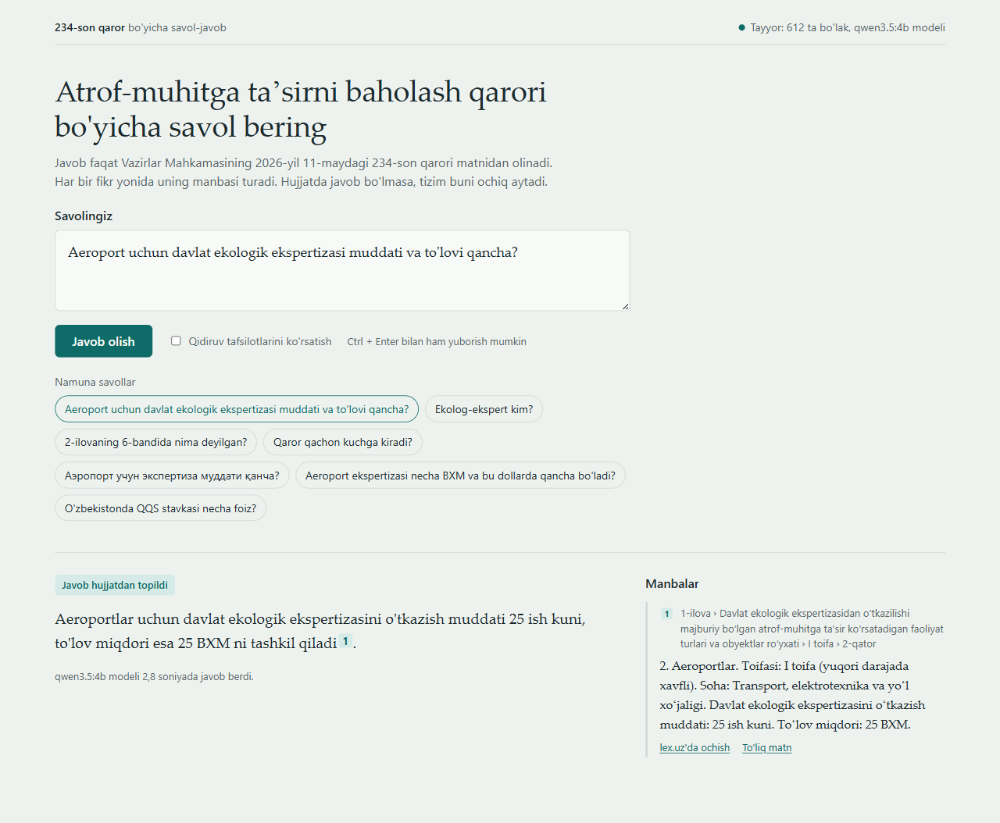
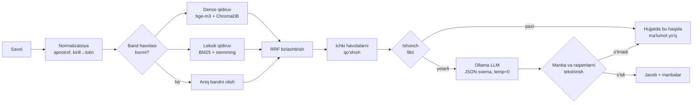
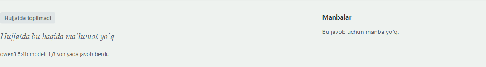
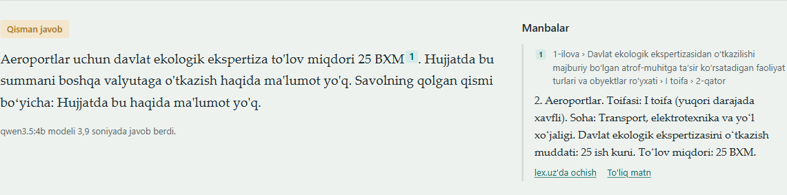

# 234-son qaror bo'yicha RAG API

Vazirlar Mahkamasining 2026-yil 11-maydagi **234-son qarori** — *"Atrof-muhitga taʼsirni baholashning yangi mexanizmlarini joriy qilish chora-tadbirlari toʻgʻrisida"* — matni asosida savollarga **faqat hujjatdan** javob beradigan, **to'liq lokal** ishlaydigan RAG (Retrieval-Augmented Generation) API.

- Manba: https://lex.uz/uz/docs/-8193120
- Stack: Python 3.12 · FastAPI (async) · Ollama · ChromaDB · BM25
- Hujjatda javob bo'lmasa, API aniq shu javobni qaytaradi: **`Hujjatda bu haqida ma'lumot yo'q`**
- Modellar: `qwen3.5:4b` (javob) + `bge-m3` (embedding) — tanlov o'lchov asosida ([Baholash](#baholash-evaluation))



> Qo'shimcha hujjatlar:
> - [`docs/PROJECT_DETAILS.md`](docs/PROJECT_DETAILS.md) — loyiha haqida batafsil texnik ma'lumot (modullar, API, indeks formati, testlar, natijalar)
> - [`docs/PRESENTATION.md`](docs/PRESENTATION.md) — taqdimot: arxitektura, qarorlar, demo ssenariysi, savol-javoblar
> - [`openspec/`](openspec/) — formal spetsifikatsiyalar va dizayn

---

## Mundarija

1. [Asosiy imkoniyatlar](#asosiy-imkoniyatlar)
2. [Arxitektura](#arxitektura)
3. [Tezkor ishga tushirish (Docker)](#tezkor-ishga-tushirish-docker)
4. [Lokal ishga tushirish (Docker'siz)](#lokal-ishga-tushirish-dockersiz)
5. [API'dan foydalanish](#apidan-foydalanish)
6. [Konfiguratsiya](#konfiguratsiya)
7. [Qanday ishlaydi](#qanday-ishlaydi)
8. [Baholash (evaluation)](#baholash-evaluation)
9. [Testlar](#testlar)
10. [Loyiha tuzilmasi](#loyiha-tuzilmasi)
11. [Muammolarni hal qilish](#muammolarni-hal-qilish)

---

## Asosiy imkoniyatlar

| | |
|---|---|
| **Faqat hujjatdan javob** | Har bir javobda manba bor: band matnidan iqtibos va lex.uz'dagi **aynan o'sha bandga** havola. |
| **Kafolatlangan rad javobi** | Hujjatda yo'q ma'lumot so'ralsa, `Hujjatda bu haqida ma'lumot yo'q` qaytadi. Bu matnni model emas, kod yozadi, shuning uchun u doim aniq. |
| **Strukturaviy chunking** | Hujjat band, atama, jadval qatori va sxema bosqichi bo'yicha bo'linadi. Har bir bo'lakda uning hujjatdagi yo'li ko'rsatiladi: `2-ilova › Nizom › 1-bob › 6-band`. |
| **Gibrid qidiruv** | Semantik qidiruv (bge-m3) va BM25 (o'zbekcha qo'shimchalarni ajratish bilan) RRF orqali birlashtiriladi. "2-ilovaning 6-bandi" kabi so'rovlar to'g'ridan-to'g'ri o'sha bandga yo'naltiriladi. |
| **4 qatlamli himoya** | Ishonch darajasi filtri → qat'iy prompt → JSON-sxema → manba va raqamlarni kod bilan tekshirish. |
| **Yozuvga bog'liq emas** | Kirill yoki lotinda yozilgan savol, `o'` / `oʻ` / ``o` `` kabi har xil apostroflar bir xil natija beradi. |
| **To'liq lokal** | Barcha model chaqiruvlari lokal Ollama'ga ketadi. Indeks qurilgach, internet kerak emas. |
| **O'lchanadigan sifat** | Oltin savollar to'plami bilan retrieval va javob sifati raqamlarda o'lchanadi. |

## Arxitektura



Hujjat bir marta indekslanadi (`lex.uz HTML → tuzilma daraxti → chunk'lar → embedding → ChromaDB + BM25`). Keyingi ishga tushirishlarda tayyor indeks qayta ishlatiladi.

## Tezkor ishga tushirish (Docker)

**Talablar:** Docker Desktop yoki Docker Engine (Compose v2), ~10 GB bo'sh disk. GPU ixtiyoriy: NVIDIA drayveri va (Linux'da) NVIDIA Container Toolkit.

```bash
# 1. Repozitoriyni yuklab olish
git clone https://github.com/kamronbek04/qaror-234-rag.git
cd qaror-234-rag

# 2. Sozlamalar fayli
cp .env.example .env            # PowerShell: Copy-Item .env.example .env

# 3a. CPU'da ishga tushirish (hamma joyda ishlaydi)
docker compose up -d

# 3b. yoki NVIDIA GPU bilan (tezroq)
docker compose -f docker-compose.yml -f docker-compose.gpu.yml up -d

# 4. Jarayonni kuzatish: modellar yuklanishi va indeks qurilishi
docker compose logs -f api
```

Birinchi ishga tushishda modellar (~4.6 GB) yuklab olinadi va indeks quriladi (~1 daqiqa). Bu internet tezligiga qarab 5–15 daqiqa oladi. Keyingi ishga tushishlar bir necha soniyada bo'ladi.

Tayyor bo'lgach:

| Manzil | Nima |
|---|---|
| http://localhost:8000/ | Demo sahifa (savol berish va manbalarni ko'rish) |
| http://localhost:8000/docs | Swagger / OpenAPI hujjatlari |
| http://localhost:8000/health | Tizim holati |

To'xtatish: `docker compose down`. Modellar va indeks volume'larda saqlanib qoladi.

## Lokal ishga tushirish (Docker'siz)

**1. Python 3.11+ o'rnating** (3.12 tavsiya etiladi).

**2. Ollama'ni o'rnating va ishga tushiring**
- Windows / macOS: https://ollama.com/download dan o'rnatib, ilovani oching.
- Linux: `curl -fsSL https://ollama.com/install.sh | sh`

**3. Modellarni yuklab oling**
```bash
ollama pull qwen3.5:4b
ollama pull bge-m3
```

**4. Virtual muhit yarating va kutubxonalarni o'rnating**

Windows (PowerShell):
```powershell
py -3.12 -m venv .venv
.\.venv\Scripts\Activate.ps1
pip install -e ".[dev]"
Copy-Item .env.example .env
```

Linux / macOS:
```bash
python3.12 -m venv .venv
source .venv/bin/activate
pip install -e ".[dev]"
cp .env.example .env
```

**5. Indeksni quring** (bir marta, ~1–3 daqiqa)
```bash
python -m app.cli ingest
```

**6. API'ni ishga tushiring**
```bash
uvicorn app.main:app --host 0.0.0.0 --port 8000
```

**7. Tekshiring**
```bash
curl http://localhost:8000/health
```

> Unix'da `make install`, `make ingest`, `make run`, `make test` buyruqlari ham bor.

## API'dan foydalanish

| Metod | Yo'l | Vazifasi |
|---|---|---|
| `POST` | `/api/v1/ask` | Savolga javob va manbalar |
| `POST` | `/api/v1/search` | Faqat qidiruv, LLM chaqirilmaydi. Qaysi bandlar qanday ball bilan topilganini ko'rsatadi |
| `GET` | `/api/v1/chunks/{chunk_id}` | Bitta bo'lakning to'liq matni va metama'lumoti |
| `GET` | `/health` | Ollama, modellar va indeks holati (`200` yoki `503`) |

### Savol berish

```bash
curl -X POST http://localhost:8000/api/v1/ask \
  -H "Content-Type: application/json" \
  -d '{"question": "Aeroport uchun davlat ekologik ekspertizasi muddati va to'\''lovi qancha?"}'
```

PowerShell:
```powershell
$body = @{ question = "Aeroport uchun davlat ekologik ekspertizasi muddati va to'lovi qancha?" } | ConvertTo-Json
Invoke-RestMethod -Method Post -Uri http://localhost:8000/api/v1/ask -ContentType "application/json; charset=utf-8" -Body $body
```

Javob namunasi (haqiqiy javob, qisqartirilgan):
```json
{
  "answer": "Aeroport uchun davlat ekologik ekspertizasini o'tkazish muddati 25 ish kuni, to'lov miqdori 25 BXM [a1-r2].",
  "status": "answered",
  "found": true,
  "sources": [
    {
      "chunk_id": "a1-r2",
      "breadcrumb": "1-ilova › Davlat ekologik ekspertizasidan oʻtkazilishi majburiy boʻlgan … roʻyxati › I toifa › 2-qator",
      "quote": "2. Aeroportlar. Toifasi: I toifa (yuqori darajada xavfli). Soha: Transport, elektrotexnika va yoʻl xoʻjaligi. Davlat ekologik ekspertizasini oʻtkazish muddati: 25 ish kuni. Toʻlov miqdori: 25 BXM.",
      "url": "https://lex.uz/uz/docs/-8193120#-8206375",
      "score": 0.7706
    }
  ],
  "meta": {
    "model": "qwen3.5:4b",
    "request_id": "3f9c2a71b0d44e18",
    "timings_ms": { "retrieval": 62, "generation": 3100, "total": 3170 }
  }
}
```

Hujjatda yo'q savol (LLM chaqirilmaydi, filtrda to'xtaydi):



```json
{
  "answer": "Hujjatda bu haqida ma'lumot yo'q",
  "status": "not_found",
  "found": false,
  "sources": [],
  "meta": { "...": "..." }
}
```

`status` qiymatlari: `answered` (to'liq javob), `partial` (savolning bir qismiga javob bor, qolgani uchun "Hujjatda bu haqida ma'lumot yo'q" deyiladi), `not_found`.



`"debug": true` yuborilsa, javobga qidiruv nomzodlari (dense, BM25 va RRF ballari) hamda tekshiruv qarorlari qo'shiladi.

## Konfiguratsiya

Barcha sozlamalar muhit o'zgaruvchilari yoki `.env` orqali beriladi (namuna: [`.env.example`](.env.example)).

| O'zgaruvchi | Standart | Tavsif |
|---|---|---|
| `OLLAMA_BASE_URL` | `http://localhost:11434` | Ollama manzili (Docker ichida `http://ollama:11434`) |
| `LLM_MODEL` | `qwen3.5:4b` | Javob beruvchi model (eval bilan tanlangan) |
| `EMBED_MODEL` | `bge-m3` | Embedding modeli |
| `LLM_NUM_CTX` | `8192` | Model kontekst oynasi. Har bir so'rovda aniq beriladi |
| `LLM_TEMPERATURE` | `0` | Deterministik generatsiya |
| `LLM_THINK` | `false` | "Thinking" rejimini o'chiradi (qwen3.5 uchun zarur); bo'sh qiymat parametrni umuman yubormaydi |
| `LLM_MAX_CONCURRENCY` | `2` | Bir vaqtda ishlaydigan generatsiyalar soni |
| `LLM_TIMEOUT_S` | `120` | LLM so'rovi uchun vaqt chegarasi |
| `RETRIEVAL_TOP_K` | `6` | Kontekstga olinadigan bo'laklar soni |
| `RETRIEVAL_CANDIDATES` | `30` | Dense va BM25 qidiruvning har biridan olinadigan nomzodlar |
| `CONTEXT_TOKEN_BUDGET` | `3500` | Kontekstdagi bo'laklar uchun token chegarasi |
| `REFUSAL_THRESHOLD` | `0.50` | Ishonch filtri chegarasi. Qiymat eval bilan kalibrlanadi |
| `CHUNK_STRATEGY` | `structural` | `structural` yoki `fixed` (taqqoslash uchun) |
| `CHUNK_MAX_CHARS` | `1500` | Bo'lakning maksimal uzunligi |
| `INDEX_DIR` | `data/index` | Indeks saqlanadigan joy |
| `AUTO_INGEST` | `true` | Indeks yo'q yoki eskirgan bo'lsa, ishga tushishda qayta qurish |
| `LOG_LEVEL` | `INFO` | Log darajasi |

### Apparat profillari

| Profil | Chat model | Xotira | Izoh |
|---|---|---|---|
| Standart (8 GB GPU yoki CPU) | `qwen3.5:4b` | ~4 GB | Eval'da eng yaxshi natija. CPU'da ham ishlaydi, faqat sekinroq |
| 12 GB+ GPU | `qwen3.5:9b` | ~6–7 GB VRAM | Sifati yaqin, lekin sekinroq |
| TZ tavsiyasi | `qwen2.5:7b` | ~5 GB VRAM | Qo'llab-quvvatlanadi, lekin o'zbek tilida kuchsizroq ([natijalar](#baholash-evaluation)) |

Model almashtirish uchun `.env` da `LLM_MODEL` ni o'zgartirib, `ollama pull <model>` qilinadi. Indeksni qayta qurish kerak emas.

## Qanday ishlaydi

**1. Hujjatni qayta ishlash.** lex.uz sahifasining nusxasi repoda saqlanadi (`data/raw/`), shuning uchun indeks internetsiz ham qayta quriladi. HTML'dagi semantik CSS klasslar asosida hujjat daraxti tuziladi: qaror → ilova → nizom → bob → band → kichik bandlar, jadvallar, sxemalar, izohlar. lex.uz interfeys matnlari tozalanadi.

**2. Chunking.** Hujjat so'z soni bo'yicha emas, huquqiy tuzilma bo'yicha bo'linadi:
- har bir band o'zining kichik bandlari bilan bitta bo'lak;
- har bir atama ta'rifi alohida bo'lak;
- 1-ilova jadvalining 221 qatorining har biri to'liq gapga aylantiriladi (toifa, soha, muddat, to'lov);
- sxemaning har bir bosqichi alohida bo'lak.

Har bir bo'lakda uning hujjatdagi yo'li va lex.uz havolasi bor.

**3. Qidiruv.** Semantik va leksik natijalar RRF bilan birlashtiriladi. Savolda aniq band ko'rsatilsa, o'sha band birinchi o'ringa chiqadi. Topilgan band boshqa bandga havola qilsa ("ushbu Nizomning 4-bandida…"), o'sha band ham kontekstga qo'shiladi.

**4. Javob va himoya.**
1. Eng yaxshi natijaning o'xshashligi chegaradan past bo'lsa, LLM chaqirilmaydi.
2. Model faqat berilgan bo'laklardan, JSON-sxema bo'yicha va manba ko'rsatib javob beradi.
3. Kod quyidagilarni tekshiradi:
   - ko'rsatilgan manba haqiqatan kontekstda bormi;
   - javobdagi har bir raqam (muddat, BXM, foiz) manba matnida bormi;
   - so'z bilan yozilgan raqamlar ("yigirma besh") va valyutalar ("dollar") manbada bormi.

   Savolda aniq band yoki hujjatdagi raqam (masalan, "541-son") bo'lsa, u o'xshashlik past bo'lsa ham modelga yetib boradi.

Tekshiruvdan o'tmagan javob foydalanuvchiga chiqmaydi.

Batafsil: [`docs/PRESENTATION.md`](docs/PRESENTATION.md).

## Baholash (evaluation)

`eval/dataset.jsonl` 54 ta savoldan iborat (35 ta hujjatdagi, 10 ta hujjatda yo'q, 5 ta tuzoq, 4 ta qisman javobli). Ular to'rt turga bo'linadi: hujjatdagi savollar, hujjatda yo'q savollar, "tuzoq" savollar (masalan, bekor qilingan 541-son qaror mazmuni yoki kuchga kirishning kalendar sanasi) va qisman javobli savollar.

```bash
python -m app.cli eval retrieval                     # hit@k, MRR, chegara tavsiyasi
python -m app.cli eval retrieval --compare-chunking  # structural va fixed-size taqqoslash
python -m app.cli eval e2e                           # to'liq pipeline: rad etish aniqligi, faktlar, manbalar, kechikish
python -m app.cli eval e2e --models qwen2.5:7b,qwen3.5:4b,qwen3.5:9b
```

Hisobotlar `eval/reports/` papkasiga Markdown va JSON ko'rinishida yoziladi.

**Natijalar** (RTX 4060 8 GB; hisobotlar: [`retrieval`](eval/reports/20260911T084932-retrieval.md), [`e2e`](eval/reports/20260911T085845-e2e.md)):

| Retrieval | Qiymat |
|---|---|
| hit@1 / **hit@5** / MRR | 0.872 / **0.949** / 0.903 |
| Strukturaviy vs fixed-size chunking (hit@5) | **0.947** vs 0.816 |
| Strukturaviy vs fixed-size chunking (hit@1) | **0.895** vs 0.500 |
| Filtr (chegara 0.50) | hujjatda yo'q savollarning 8/15 qismini to'xtatadi, hujjatdagilardan birortasini ham to'xtatmaydi (0/39) |

| Model | Faktlar aniqligi | Noto'g'ri rad | Rad etish recall | Partial | p50 |
|---|---|---|---|---|---|
| `qwen2.5:7b` | 0.800 | 0.114 | 1.000 | 0.25 | 2.9 s |
| **`qwen3.5:4b`** | **0.943** | **0.000** | 0.933 | **0.75** | 2.9 s |
| `qwen3.5:9b` | 0.914 | 0.029 | 0.933 | 0.50 | 4.1 s |

| Maqsad | `qwen3.5:4b` |
|---|---|
| Faktlar aniqligi ≥ 0.85 | 0.943 ✅ |
| Noto'g'ri rad ≤ 0.10 | 0.000 ✅ |
| Retrieval hit@5 ≥ 0.90 | 0.949 ✅ |
| Rad etish recall ≥ 0.95 | 0.933 ❌ — 15 tadan 1 ta: model rad izohidan keyin aloqasiz fakt qo'shdi ([batafsil](docs/PROJECT_DETAILS.md#11-baholash-natijalari)) |

## Testlar

```bash
pytest               # 192 ta test, Ollama talab qilinmaydi (soxta embedder va model), ~15 soniya
pytest -m ollama     # Integratsion testlar: ishlab turgan Ollama kerak
ruff check . && ruff format --check .
```

## Loyiha tuzilmasi

```
app/
  core/         # sozlamalar, loglar, xatolar, DI konteyner
  domain/       # domen modellari (DocumentNode, Chunk, Answer …)
  text/         # normalizatsiya, o'zbekcha stemmer, raqamlarni ajratish
  ingestion/    # manba, lex.uz parser, chunker, indekslash pipeline
  retrieval/    # embedder, ChromaDB, BM25, RRF, band havolalari, retriever
  generation/   # promptlar, Ollama chat klienti, javobni tekshiruvchi guard
  services/     # RagService — butun jarayon orkestratori
  api/          # FastAPI routerlari va sxemalar
  web/          # demo sahifa
eval/           # oltin savollar, metrikalar, hisobotlar
tests/          # unit, API va integratsion testlar
data/raw/       # lex.uz sahifasining nusxasi
openspec/       # spetsifikatsiyalar va dizayn hujjatlari
docs/           # taqdimot hujjati
```

## Muammolarni hal qilish

| Belgi | Yechim |
|---|---|
| `/health` → `503`, `model_missing` | `ollama pull <model>` (Docker'da: `docker compose run --rm models`) |
| Birinchi savol ~1 daqiqa oldi | Model GPU'ga birinchi marta yuklanmoqda. Keyingi savollar 2–5 soniya |
| `/health` → `503`, `index_stale` | `python -m app.cli ingest` yoki `AUTO_INGEST=true` bilan qayta ishga tushirish |
| Javob juda sekin | GPU override faylidan foydalaning yoki `LLM_MODEL=qwen3.5:4b` qo'ying |
| `11434` port band | Tizimdagi Ollama va Docker'dagi Ollama bir vaqtda ishlayapti, bittasini to'xtating |
| Windows'da Docker GPU'ni ko'rmaydi | Docker Desktop → WSL2 backend, NVIDIA drayverini yangilang |
| Hujjat yangilangan | `python -m app.cli ingest --refresh`. lex.uz'dan qayta yuklaydi va tekshiradi |

## Hujjat manbasi

- Qaror: Vazirlar Mahkamasining 2026-yil 11-maydagi 234-son qarori
- URL: https://lex.uz/uz/docs/-8193120
- Nusxa olingan sana: 2026-09-11 (`data/raw/SOURCE.md` da SHA-256 bilan)
