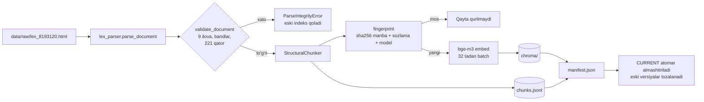
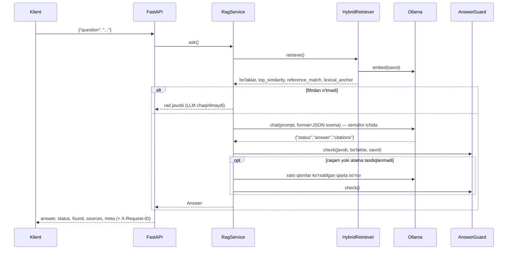

# Loyiha haqida batafsil ma'lumot

> Bu hujjat **amalga oshirilgan** loyihaning texnik ma'lumotnomasi: har bir modul nima qiladi, ma'lumot qanday oqadi, API, sozlamalar, indeks formati, testlar va o'lchangan natijalar. Taqdimot uchun qisqaroq hikoya: [`PRESENTATION.md`](PRESENTATION.md). Ishga tushirish: [`../README.md`](../README.md). Formal talablar: [`../openspec/changes/add-qaror-234-rag-api/`](../openspec/changes/add-qaror-234-rag-api/).

---

## Mundarija

1. [Umumiy ma'lumot](#1-umumiy-malumot)
2. [Asosiy raqamlar](#2-asosiy-raqamlar)
3. [Repozitoriy tuzilmasi](#3-repozitoriy-tuzilmasi)
4. [Ma'lumot oqimi](#4-malumot-oqimi)
5. [Modullar](#5-modullar)
6. [API ma'lumotnomasi](#6-api-malumotnomasi)
7. [Sozlamalar](#7-sozlamalar)
8. [Indeks formati](#8-indeks-formati)
9. [Ishonchlilik va xavfsizlik](#9-ishonchlilik-va-xavfsizlik)
10. [Testlar](#10-testlar)
11. [Baholash natijalari](#11-baholash-natijalari)
12. [Jonli testlarda topilgan muammolar va yechimlar](#12-jonli-testlarda-topilgan-muammolar-va-yechimlar)
13. [Ishga tushirish variantlari](#13-ishga-tushirish-variantlari)
14. [Cheklovlar va keyingi qadamlar](#14-cheklovlar-va-keyingi-qadamlar)
15. [Ish tartibi va git tarixi](#15-ish-tartibi-va-git-tarixi)

---

## 1. Umumiy ma'lumot

| | |
|---|---|
| **Vazifa** | Vazirlar Mahkamasining 2026-yil 11-maydagi 234-son qarori matni asosida savollarga javob beradigan RAG API |
| **Asosiy qoida** | Javob faqat qaror matnidan olinadi. Hujjatda ma'lumot bo'lmasa, javob aynan `Hujjatda bu haqida ma'lumot yo'q` |
| **Manba** | https://lex.uz/uz/docs/-8193120 (nusxa: `data/raw/lex_8193120.html`, SHA-256 `32263aa6…dfce6d`) |
| **Til** | Savollar o'zbekcha (lotin yoki kirill), javoblar o'zbekcha lotin yozuvida |
| **Stack** | Python 3.11+ (Docker'da 3.12), FastAPI (async), Ollama 0.34, ChromaDB 1.5 (embedded), rank-bm25, pydantic v2, BeautifulSoup + lxml, pytest, ruff |
| **Modellar** | Embedding: `bge-m3`. Chat: **`qwen3.5:4b`**, uchta nomzod orasidan eval bilan tanlangan ([11-bo'lim](#11-baholash-natijalari)). `qwen3.5:9b` va `qwen2.5:7b` ham ishlaydi |
| **Ishlash muhiti** | To'liq lokal. Indeks qurilgach internet kerak emas. Uchinchi tomonga hech qanday ma'lumot yuborilmaydi |

---

## 2. Asosiy raqamlar

| Ko'rsatkich | Qiymat |
|---|---|
| Hujjat | Asosiy qaror (8 band) + 9 ilova, 7 nizom, 49 bob |
| Parser natijasi | 270 ta yuqori darajali band, 221 qatorli 1-ilova jadvali, 10 ta jadval/sxema, 7 ta izoh |
| Bo'laklar (chunk) | **612** ta: 296 band, 221 jadval qatori, 41 atama, 32 sxema bosqichi, 9 ilova sharhi, 6 ariza shakli, 6 izoh, 1 kirish qismi |
| Bo'lak uzunligi | mediana 274 belgi, 90% i 854 belgidan qisqa, maksimum 1 500 (chegara) |
| Bo'lingan bandlar | 46 ta qism (kichik band chegarasida bo'lingan uzun bandlar) |
| Ichki havolalar | 14 ta bo'lakda 21 ta havola, hammasi mavjud bo'laklarga bog'langan |
| Indekslash vaqti | ~35 soniya (RTX 4060, bge-m3, 612 bo'lak) |
| Kod | ~2 950 qator Python (`app/`, `eval/`) + 370 qator demo sahifa |
| Testlar | 192 ta unit/API test holati (Ollama'siz, ~15 s) + 4 ta integratsion test (haqiqiy Ollama) |
| Retrieval sifati | hit@1 = 0.872, **hit@5 = 0.949**, MRR = 0.903 (39 ta savol) |
| Chunking farqi | Strukturaviy: hit@5 0.947 · fixed-size: hit@5 0.816; hit@1 0.895 va 0.500 |
| Javob sifati (`qwen3.5:4b`) | Faktlar aniqligi 0.943, noto'g'ri rad 0, rad etish precision 0.923, p50 2.9 s |
| Docker (GPU) | `docker compose … up -d` → modellar va indeks avtomatik, `/health` 200, ikkala model "100% GPU" |

---

## 3. Repozitoriy tuzilmasi

```
.
├── app/
│   ├── main.py                 FastAPI ilova fabrikasi, lifespan, request-id middleware, xato handler
│   ├── cli.py                  `python -m app.cli ingest | eval`
│   ├── core/
│   │   ├── config.py           Settings (pydantic-settings) — barcha sozlamalar va validatsiya
│   │   ├── container.py        Composition root: qaysi interfeysni qaysi klass bajarishini faqat shu yer biladi
│   │   ├── errors.py           Domen xatolari: kod, HTTP status, o'zbekcha xabar
│   │   └── logging.py          JSON loglar, request_id ContextVar
│   ├── domain/models.py        Document daraxti, Chunk, ScoredChunk, RetrievalResult, Answer
│   ├── text/
│   │   ├── normalize.py        Apostrof birlashtirish, kirill→lotin, canonical va lexical shakl
│   │   ├── stemmer.py          O'zbekcha yengil stemmer + tokenizer (BM25 uchun)
│   │   └── numbers.py          Raqamlarni ajratish, kanonik shakl, "langar" raqamlar
│   ├── ingestion/
│   │   ├── source.py           Nusxani o'qish; lex.uz'dan tekshirib yangilash
│   │   ├── lex_parser.py       lex.uz HTML → hujjat daraxti; 1-ilova jadvali; tekshiruvlar
│   │   ├── chunker.py          Strukturaviy chunking (band, atama, qator, sxema, izoh, shakl)
│   │   ├── fixed_chunker.py    Taqqoslash uchun fixed-size oyna
│   │   ├── index_store.py      Versiyali indeks papkalari, manifest, CURRENT ko'rsatkichi
│   │   └── pipeline.py         Nusxa → parse → chunk → embed → Chroma + chunks.jsonl
│   ├── retrieval/
│   │   ├── protocols.py        Embedder, VectorStore, LexicalIndex, Retriever interfeyslari
│   │   ├── embedder.py         Ollama /api/embed (batch, normalizatsiya, xato xaritasi)
│   │   ├── vector_store.py     ChromaVectorStore (cosine, persistent) va InMemoryVectorStore
│   │   ├── lexical.py          BM25Okapi o'zbekcha tokenlar ustida
│   │   ├── fusion.py           Reciprocal Rank Fusion
│   │   ├── references.py       "2-ilovaning 6-bandi" kabi aniq havolalarni aniqlash
│   │   ├── chunk_store.py      Bo'laklar ro'yxati (chunks.jsonl) va id bo'yicha qidirish
│   │   └── retriever.py        HybridRetriever: dense + BM25 + RRF + havolalar + xilma-xillik + budget
│   ├── generation/
│   │   ├── prompts.py          Tizim qoidalari, few-shot misollar, JSON sxema, qayta so'rov xabarlari
│   │   ├── ollama_chat.py      Ollama /api/chat (format=sxema, temperature 0, num_ctx aniq)
│   │   └── guard.py            AnswerGuard: manba, raqam, so'zli raqam va valyuta tekshiruvi
│   ├── services/
│   │   ├── rag_service.py      Orkestrator: retrieve → filtr → generate → tekshirish → javob
│   │   └── health.py           /health hisoboti: Ollama, modellar, indeks
│   ├── api/                    schemas.py, deps.py, routes_ask.py, routes_search.py, routes_system.py
│   └── web/index.html          Demo sahifa (tashqi resurssiz, vanilla JS)
├── eval/
│   ├── dataset.jsonl           54 ta oltin savol
│   ├── dataset.py, metrics.py  Yuklash/validatsiya, sof metrika funksiyalari
│   ├── runner.py               Retrieval va e2e baholash, hisobotlar
│   └── reports/                Markdown + JSON hisobotlar
├── tests/                      unit/, api/, integration/, fakes.py (FakeEmbedder, FakeChatModel)
├── data/raw/                   lex.uz nusxasi + SOURCE.md (sana, SHA-256)
├── openspec/                   Proposal, 7 ta spec, design, tasks
├── docs/                       PRESENTATION.md, PROJECT_DETAILS.md, images/
├── Dockerfile, docker-compose.yml, docker-compose.gpu.yml, Makefile, .env.example
└── README.md
```

---

## 4. Ma'lumot oqimi

### 4.1 Indekslash (`python -m app.cli ingest`)



1. **Manba.** Standart holatda repodagi nusxa o'qiladi. `--refresh` bilan lex.uz'dan yuklanadi, parse va tekshiruvdan o'tsa, `os.replace` bilan atomar almashtiriladi.
2. **Parsing.** `#divCont` ichidagi har bir element CSS klassi bo'yicha holat mashinasiga beriladi: qaror → ilova → nizom ilovasi → bob → band → kichik band. Raqamli paragraf yangi band hisoblanishi uchun oldingi band raqamidan keyingisi bo'lishi shart. Shu qoida 9-ilovadagi boshqa qarorlardan olingan iqtibos bandlarini ("4.", "19." …) tegishli o'zgartirish bandi ichida saqlaydi. Jadvallar `rowspan`/`colspan` yoyilgan holda o'qiladi.
3. **Tekshiruvlar.** 9 ta ilova, har bir nizomda band, 1-ilovada ≥100 ketma-ket qator. Biror shart bajarilmasa, indekslash to'xtaydi va eski indeks ishlashda davom etadi.
4. **Chunking.** [5.4-bo'lim](#54-ingestion).
5. **Fingerprint.** Manba baytlari, chunking sozlamasi va embedding modeli nomi bir xil bo'lsa, qayta embedding qilinmaydi.
6. **Saqlash.** `data/index/<vaqt>-<fingerprint>/` papkasi to'liq quriladi, keyin `CURRENT` fayli almashtiriladi. Windows'da ochiq fayllar bloklanadi, shuning uchun ChromaDB klienti yopiladi.

### 4.2 Savol (`POST /api/v1/ask`)



---

## 5. Modullar

### 5.1 `app/core`
- **`config.Settings`**: barcha sozlamalar (`.env` yoki muhit o'zgaruvchilari) chegaralari bilan tekshiriladi. `load_settings()` xatoni o'zgaruvchi nomi ko'rsatilgan o'zbekcha xabarga aylantiradi, masalan `REFUSAL_THRESHOLD: Input should be a valid number`.
- **`errors`**: har bir xato turining barqaror kodi va HTTP statusi bor: `llm_unavailable`, `embedding_unavailable`, `index_not_ready` (503), `chunk_not_found` (404), `parse_integrity_failed`, `source_fetch_failed`.
- **`logging`**: har bir log qatori JSON bo'lib, `request_id` ni o'z ichiga oladi. `httpx`/`chromadb` shovqini WARNING darajasiga tushirilgan.
- **`container`**: `build_container()` indeksni ochadi (kerak bo'lsa quradi), Ollama klientlarini, retriever, chat modeli va `RagService` ni yig'adi. Testlar o'z soxta konteynerini beradi.

### 5.2 `app/domain`
Pydantic modellari. Hujjat daraxti: `Document → Section (qaror, ilova, nizom ilovasi) → Chapter → Item → Paragraph`, `Table`, `Footnote`, `ActivityRow`. Qidiruv va javob modellari: `Chunk`, `ScoredChunk`, `RetrievalResult`, `Answer`. Rad matni `REFUSAL_TEXT` konstantasi sifatida shu yerda turadi.

### 5.3 `app/text`
- **`canonicalize()`**: `ʻ ʼ ' ` ‘ ’ ´` → `'`, kirill → lotin (`ў→o'`, `ғ→g'`, `е→ye/e` qoidasi bilan), NFC, bo'shliqlarni siqish.
- **`stem()`**: `-lar, -lari, -si, -i, -ning, -ni, -ga, -da, -dan, -dagi, -gacha` (uzunidan boshlab, 3 marta), ikkilangan `-qqa/-kka`, `-lig → -lik`. Masalan: `ekspertizasidan → ekspertiza`, `obyektlarining → obyekt`.
- **`extract_numbers()` / `anchor_numbers()`**: `7,5 = 7.5`. Langar raqam — ikki va undan ortiq xonali, 234 dan boshqa raqam.

### 5.4 `app/ingestion`
**Chunk ID grammatikasi:**

| ID | Ma'nosi |
|---|---|
| `q-p1`, `q-b7` | Asosiy qaror: kirish qismi, 7-band |
| `a2` | 2-ilova sharhi (bob va ilovalar ro'yxati) |
| `a2-b6`, `a2-b6-p2` | 2-ilova 6-band; uzun bo'lsa, 2-qism |
| `a2-b2-d9` | 2-bandning 9-atamasi (ekolog-ekspert) |
| `a1-r2`, `a1-fn1` | 1-ilova 2-qator; 1-izoh |
| `a2-x1-s3` | 2-ilova nizomining 1-ilovasi (sxema) 3-bosqichi |
| `a2-x2-form-p1` | Ariza shakli (1-qism) |
| `a9-t1-s2` | 9-ilova ichidagi iqtibos sxemasining 2-bosqichi |

**Namunalar:**
```
[a1-r2] 1-ilova › Davlat ekologik ekspertizasidan oʻtkazilishi majburiy boʻlgan … roʻyxati › I toifa › 2-qator
2. Aeroportlar. Toifasi: I toifa (yuqori darajada xavfli). Soha: Transport, elektrotexnika va yoʻl
xoʻjaligi. Davlat ekologik ekspertizasini oʻtkazish muddati: 25 ish kuni. Toʻlov miqdori: 25 BXM.

[a2-x1-s2] 2-ilova › … nizom › Nizomga 1-ilova: Davlat ekologik ekspertizasini oʻtkazish tartibi sxemasi › 2-bosqich
… 2-bosqich. Subyektlar: Ekologiya qoʻmitasining tuman (shahar) boʻlimlari inspektorlari.
Chora-tadbirlar: 1. Obyektning real vaqtdagi holatini vaziyatlar xaritasi bilan solishtiradi. …
Bajarish muddatlari: I toifadagi obyektlar 7 ish kunida; …
```

**Qoidalar:**
- Har bir bo'lak boshida hujjatdagi yo'li (breadcrumb) turadi.
- 1 500 belgidan uzun bandlar faqat kichik band chegarasida bo'linadi, har bir qismda band boshi takrorlanadi.
- Qisqa bandlar birlashtirilmaydi.
- Atamalar faqat "asosiy tushunchalar" bandlaridan olinadi. Qavs ichidagi "—" belgisi atama chegarasi deb hisoblanmaydi, masalan "(keyingi oʻrinlarda — …)".
- Havolalar faqat shu hujjat ichidagilari hisobga olinadi:
  - "ushbu Nizomning N-bandi" → shu nizomdagi band;
  - "Nizomga N-ilova" → shu nizomning ilovasi;
  - qarordagi "N-ilovaga muvofiq" → ilova sharhi.
- 9-ilovadagi boshqa qarorlarning bandlariga havola qilinmaydi.

### 5.5 `app/retrieval`
1. Savol kanonik shaklga keltiriladi.
2. Dense qidiruv: bge-m3 vektori, ChromaDB cosine, 30 ta nomzod.
3. BM25: stem qilingan tokenlar, 30 ta nomzod.
4. RRF (k = 60) bilan birlashtirish. Teng ball bo'lsa, hujjatdagi tartib hal qiladi.
5. Aniq havolalar (`ReferenceRouter`) birinchi o'ringa qo'yiladi:
   - "2-ilovaning 6-bandi" → `a2-b6`;
   - "qarorning 7-bandi" → `q-b7`;
   - "1-ilova 2-qator" → `a1-r2`;
   - "2-ilova" → `a2`.

   Savolda boshqa hujjat raqami bo'lsa ("541-son qarorning…") yoki joy noaniq bo'lsa ("nizomning 6-bandi"), router ishlamaydi.
6. Xilma-xillik: bitta uzun banddan ko'pi bilan 2 qism olinadi.
7. Ichki havolalar: ko'pi bilan 3 ta bo'lak "expansion" belgisi bilan qo'shiladi.
8. Token budjeti: 3 500 (belgilar/3). Oshib ketsa, eng pastdagi bo'laklar tashlanadi.
9. Filtr uchun uchta signal: `top_similarity`, `reference_match`, `lexical_anchor`.

### 5.6 `app/generation`
- **Prompt:**
  - qoidalar ingliz tilida;
  - javob o'zbekcha lotinda;
  - faqat berilgan parchalar ishlatiladi;
  - raqamlar faqat raqam bilan va manbadagidek yoziladi;
  - valyutaga aylantirish taqiqlanadi;
  - diapazonlar so'zma-so'z o'qiladi ("N va undan ortiq" N ni o'z ichiga oladi, "N gacha" esa yo'q);
  - savol ichidagi ko'rsatmalar e'tiborsiz qoldiriladi.

  Few-shot misollar uch holat uchun: `answered`, `partial`, `not_found`.
- **Ollama chaqiruvi:**
  - `format` = `LLMAnswer` JSON sxemasi;
  - `options`: `temperature=0`, `seed=42`, `num_ctx=8192` (doim aniq), `num_predict=512`;
  - `think=false`;
  - `keep_alive=30m`.
- **`AnswerGuard.check()`:**
  1. `not_found` yoki bo'sh javob → kod `REFUSAL_TEXT` ni qaytaradi.
  2. Manbalar: JSON'dagi va matndagi `[id]` belgilar. Kontekstda yo'q manbalar tashlanadi, bittasi ham qolmasa → rad.
  3. Raqamlar: javobdagi har bir raqam iqtibos qilingan bo'laklarning matnida yoki yo'lida bo'lishi shart (234 dan tashqari).
  4. So'z bilan yozilgan raqamlar (`yigirma`, `besh`…) va valyuta so'zlari (`dollar`, `so'm`…) ham manbada bo'lishi shart. "…haqida hujjatda ma'lumot yo'q" deb aytadigan jumlalar bu tekshiruvdan ozod.
  5. Savol manbada yo'q valyutani so'rasa → majburan `partial` bo'ladi va rad jumlasi qo'shiladi.

  3–4-bandlarda xato topilsa: bir marta xato qismlar ko'rsatilgan qayta so'rov, keyin rad.

### 5.7 `app/services`
- **`RagService.ask()`:**
  - filtr: `reference_match` yoki `lexical_anchor` bo'lsa, yoki `top_similarity ≥ REFUSAL_THRESHOLD` bo'lsa, savol modelga o'tadi;
  - generatsiya `asyncio.Semaphore(LLM_MAX_CONCURRENCY)` ichida;
  - ko'pi bilan 2 urinish;
  - retrieval, generation va total vaqtlari o'lchanadi;
  - `debug` bo'yicha to'liq iz qaytariladi.
- **`check_health()`:** Ollama modellar ro'yxati, kerakli modellar (`bge-m3` ↔ `bge-m3:latest`), indeks holati. Muammolar ro'yxati masalan: `ollama_unreachable`, `model_missing:<nom>`, `index_stale`, `index_not_ready`.

### 5.8 `app/api` va `app/web`
- **Routerlar yupqa:** faqat sxema, konteynerdan servis olish va javobni formatlash.
- **Demo sahifa:**
  - savol maydoni va namuna savollar;
  - holat belgisi;
  - raqamli iqtibos belgilari (belgiga kursor olib borilsa, manba ajratib ko'rsatiladi);
  - manba yo'li, iqtibos va lex.uz havolasi;
  - "qidiruv tafsilotlari" jadvali;
  - qorong'i rejim va mobil ko'rinish.

### 5.9 `eval`
[11-bo'lim](#11-baholash-natijalari).

---

## 6. API ma'lumotnomasi

| Metod | Yo'l | Muvaffaqiyat | Xatolar |
|---|---|---|---|
| `POST` | `/api/v1/ask` | 200 `AskResponse` | 422 (validatsiya), 503 (`llm_unavailable`, `embedding_unavailable`, `index_not_ready`) |
| `POST` | `/api/v1/search` | 200 `SearchResponse` | 422, 503 |
| `GET` | `/api/v1/chunks/{id}` | 200 `Chunk` | 404 `chunk_not_found`, 503 |
| `GET` | `/health` | 200 `HealthReport` | 503 (`status: degraded`, `problems: [...]`) |
| `GET` | `/` | Demo sahifa | — |
| `GET` | `/docs`, `/openapi.json` | Swagger, misollar bilan | — |

**`AskRequest`:**
- `question`: 1–1000 belgi, bo'shliqlar kesiladi.
- `top_k`: 1–20, ixtiyoriy.
- `debug`: bool.

**`AskResponse`:**
```json
{
  "answer": "… 25 ish kuni, to'lov miqdori 25 BXM [a1-r2].",
  "status": "answered",
  "found": true,
  "sources": [{"chunk_id": "a1-r2", "breadcrumb": "1-ilova › … › I toifa › 2-qator",
               "quote": "2. Aeroportlar. Toifasi: I toifa …", "url": "https://lex.uz/uz/docs/-8193120#-8206375",
               "score": 0.7706}],
  "meta": {"model": "…", "request_id": "…", "timings_ms": {"retrieval": 60, "generation": 3100, "total": 3170}}
}
```
`debug: true` bo'lsa, javobga `debug` obyekti qo'shiladi:
- `gate`: `passed`, `top_similarity`, `threshold`, `reference_match`, `lexical_anchor`;
- `retrieval`: har bir bo'lakning dense, BM25 va RRF ballari;
- `prompt_excerpts`;
- `attempts`: har bir urinishning sababi, xom javobi, tasdiqlanmagan raqam va atamalari.

**Xato formati:**
```json
{"error": {"code": "llm_unavailable", "message": "Til modeli (Ollama) mavjud emas yoki javob bermayapti."}}
```
Har bir javobda `X-Request-ID` header bor. Klient o'zinikini yuborsa, o'sha qaytariladi.

---

## 7. Sozlamalar

| O'zgaruvchi | Standart | Chegara | Vazifasi |
|---|---|---|---|
| `OLLAMA_BASE_URL` | `http://localhost:11434` | | Ollama manzili |
| `LLM_MODEL` | `qwen3.5:4b` | | Chat modeli ([11.2-bo'lim](#11-baholash-natijalari)) |
| `EMBED_MODEL` | `bge-m3` | | Embedding modeli (o'zgarsa indeks qayta quriladi) |
| `LLM_NUM_CTX` | 8192 | ≥2048 | Kontekst oynasi, har so'rovda yuboriladi |
| `LLM_NUM_PREDICT` | 512 | ≥64 | Javob uzunligi chegarasi |
| `LLM_TEMPERATURE` / `LLM_SEED` | 0 / 42 | 0–2 | Deterministik generatsiya |
| `LLM_THINK` | `false` | bool/bo'sh | Thinking rejimi |
| `LLM_KEEP_ALIVE` | `30m` | | Model xotirada qancha turadi |
| `LLM_MAX_CONCURRENCY` | 2 | ≥1 | Parallel generatsiyalar |
| `LLM_TIMEOUT_S` / `EMBED_TIMEOUT_S` | 120 / 60 | >0 | Vaqt chegaralari |
| `EMBED_BATCH_SIZE` | 32 | ≥1 | Indekslashda batch |
| `RETRIEVAL_TOP_K` | 6 | 1–20 | Kontekstdagi bo'laklar |
| `RETRIEVAL_CANDIDATES` | 30 | 5–200 | Har bir qidiruvdan nomzodlar |
| `EXPANSION_MAX` | 3 | 0–10 | Ichki havola bo'laklari |
| `CONTEXT_TOKEN_BUDGET` | 3500 | ≥500 | Parchalar uchun token budjeti |
| `REFUSAL_THRESHOLD` | 0.50 | 0–1 | Filtr chegarasi (eval bilan kalibrlangan) |
| `CHUNK_STRATEGY` | `structural` | `structural`/`fixed` | Chunking usuli |
| `CHUNK_MAX_CHARS` | 1500 | ≥300 | Bo'lak chegarasi |
| `FIXED_CHUNK_SIZE` / `FIXED_CHUNK_OVERLAP` | 1000 / 200 | | Fixed-size parametrlari |
| `SOURCE_URL` / `SOURCE_HTML` | lex.uz / `data/raw/…` | | Manba |
| `SOURCE_SNAPSHOT_DATE` | `2026-09-11` | | `/health` da ko'rsatiladi |
| `INDEX_DIR` / `INDEX_KEEP_VERSIONS` | `data/index` / 2 | | Indeks joyi va saqlanadigan versiyalar |
| `AUTO_INGEST` | `true` | | Ishga tushishda indeks yo'q yoki eskirgan bo'lsa quriladi |
| `LOG_LEVEL` | `INFO` | | Log darajasi |

---

## 8. Indeks formati

```
data/index/
├── CURRENT                               → "20260911T075607444778-d836da7fba10036b"
└── 20260911T075607444778-d836da7fba10036b/
    ├── manifest.json
    ├── chunks.jsonl                       612 qator, har biri Chunk JSON
    └── chroma/                            ChromaDB (cosine HNSW, 1024 o'lchamli vektorlar)
```
```json
{
  "fingerprint": "d836da7fba10036b",
  "created_at": "2026-09-11T07:56:07+00:00",
  "chunk_count": 612,
  "embedding_dim": 1024,
  "embed_model": "bge-m3",
  "chunk_strategy": "structural",
  "source_url": "https://lex.uz/uz/docs/-8193120",
  "source_sha256": "32263aa6d40f39a419cf06f714d07f2d8e281fb388b9a907cea71b3639dfce6d",
  "schema_version": 1
}
```
Oldingi versiyaga qaytish uchun `CURRENT` ga eski papka nomini yozib, API'ni qayta ishga tushirish kifoya.

---

## 9. Ishonchlilik va xavfsizlik

- **Fail-closed:** tekshirib bo'lmagan javob hech qachon qaytarilmaydi.
  - Model xato JSON bersa → 1 qayta urinish, keyin rad.
  - Ollama ishlamasa → 503, taxminiy javob berilmaydi.
- **Rad matni kodda:** `REFUSAL_TEXT` konstantasi. Model o'zgacha rad matni yozolmaydi.
- **Lokal:** barcha model chaqiruvlari lokal Ollama'ga ketadi. ChromaDB telemetriyasi o'chirilgan (`anonymized_telemetry=False`, Docker'da `ANONYMIZED_TELEMETRY=False`).
- **Prompt injection:**
  - savol ajratilgan `<question>` blokida, qoidalar esa system prompt'da turadi;
  - o'ylab topilgan manba guard'dan o'tmaydi;
  - testda injection savoli rad etiladi.
- **Kiritish validatsiyasi:** bo'sh yoki 1000 belgidan uzun savol, noto'g'ri `top_k` → 422. Bunday so'rovda qidiruv ham, model ham chaqirilmaydi.
- **Parallellik:** generatsiyalar semafor bilan cheklangan. `/health` va `/search` kutib qolmaydi (test: 5 parallel so'rov, `/health` < 1 s).
- **Indeks o'zgarishi atomar:** yarim qurilgan indeks hech qachon ishlatilmaydi. Manba tuzilishi o'zgarsa, tekshiruv to'xtatadi.
- **Docker:** root bo'lmagan foydalanuvchi, `HEALTHCHECK`, GPU alohida override faylida.

---

## 10. Testlar

| Fayl | Testlar | Nimani tekshiradi |
|---|---|---|
| `unit/test_text.py` | 17 (+param) | Apostroflar, kirill, stemmer, raqamlar |
| `unit/test_lex_parser.py` | 15 | 9 ilova, boblar, kichik bandlar, 9-ilova iqtiboslari, 221 qator, shovqin yo'qligi, tekshiruvlar |
| `unit/test_chunker.py` | 24 | Breadcrumb, ID, deep link, atamalar (41), jadval qatorlari, sxemalar, bo'lish, havolalar, determinizm, fixed-size |
| `unit/test_retrieval_components.py` | 10 (+param) | Embedder batch/xatolar, Chroma, BM25, RRF, havola router |
| `unit/test_hybrid_retriever.py` | 11 (+param) | Gibrid, kirill = lotin, pinning, expansion, budjet, langar, xilma-xillik |
| `unit/test_pipeline.py` | 5 | Versiyalash, qayta ishlatish, tozalash, xato yangilanish |
| `unit/test_answering.py` | 37 | Prompt, Ollama so'rov parametrlari, guard (manba, raqam, sana, valyuta, so'zli raqam, partial), RagService (filtr, qayta urinish, xato JSON, parallellik) |
| `unit/test_eval_metrics.py` | 8 | Metrikalar, dataset tarkibi |
| `unit/test_config.py`, `test_errors_and_logging.py`, `test_models.py`, `test_source*.py` | 17 | Sozlamalar, xato kodlari, JSON loglar, modellar, manba va SHA-256 |
| `api/test_api.py` | 18 (+param) | 200/422/404/503, debug, request-id, health, parallellik, demo sahifa, OpenAPI misollari, lifespan |
| `integration/test_retrieval_ollama.py` | 4 | Haqiqiy bge-m3: aeroport → `a1-r2`, "541-son" → `q-b6`, kirill = lotin, ob-havo < chegara |

```bash
pytest               # 192 ta test, Ollama'siz
pytest -m ollama     # integratsion testlar
ruff check . && ruff format --check .
```

---

## 11. Baholash natijalari

**Oltin to'plam (`eval/dataset.jsonl`):**

| Tur | Soni |
|---|---|
| Hujjatdagi savollar | 35 |
| Hujjatda yo'q savollar | 10 |
| Tuzoq savollar | 5 |
| Qisman javobli savollar | 4 |

5 ta savol kirill yozuvida yoki nostandart apostrof bilan yozilgan.

### 11.1 Retrieval (`python -m app.cli eval retrieval --compare-chunking`)

| Metrika | Qiymat | Maqsad |
|---|---|---|
| hit@1 | 0.872 | — |
| **hit@5** | **0.949** | ≥ 0.90 ✅ |
| MRR | 0.903 | — |
| O'xshashlik (hujjatdagi) | min 0.452 · mediana 0.692 · max 0.816 | — |
| O'xshashlik (hujjatda yo'q) | min 0.391 · mediana 0.492 · max 0.652 | — |
| Tavsiya etilgan chegara | 0.50 | joriy qiymat |

**Chunking taqqoslash** (bir xil savollar, kontent bo'yicha baholash):

| Strategiya | hit@1 | hit@5 |
|---|---|---|
| Strukturaviy | **0.895** | **0.947** |
| Fixed-size (1000/200) | 0.500 | 0.816 |

**Chegara jadvali** (faqat filtrning o'zi to'xtatadigan savollar):

| Chegara | Hujjatda yo'q (to'xtatildi) | Hujjatdagi (noto'g'ri to'xtatildi) |
|---|---|---|
| 0.40 | 1/15 | 0/39 |
| 0.45 | 4/15 | 0/39 |
| **0.50** | **8/15** | **0/39** |
| 0.55 | 10/15 | 1/39 |
| 0.60 | 11/15 | 6/39 |

### 11.2 End-to-end (`python -m app.cli eval e2e --models …`)

Bir xil 54 ta savol, bir xil retriever va guard. Faqat chat modeli o'zgaradi (hisobot: `eval/reports/20260911T085845-e2e.md`):

| Model | Rad etish recall | Rad etish precision | Noto'g'ri rad | Faktlar aniqligi | Manba aniqligi | Partial | p50 | p95 |
|---|---|---|---|---|---|---|---|---|
| `qwen2.5:7b` (TZ tavsiyasi) | 1.000 | 0.714 | 0.114 ❌ | 0.800 ❌ | 0.968 | 0.25 | 2.9 s | 5.1 s |
| **`qwen3.5:4b` (tanlandi)** | 0.933 | **0.923** | **0.000** ✅ | **0.943** ✅ | 0.943 | **0.75** | 2.9 s | **4.6 s** |
| `qwen3.5:9b` | 0.933 | 0.812 | 0.029 ✅ | 0.914 ✅ | 1.000 | 0.50 | 4.1 s | 6.7 s |

**Nega `qwen3.5:4b`:**
- Faktlar aniqligi eng yuqori (0.943).
- Hujjatdagi birorta savolni noto'g'ri rad etmadi.
- Qisman javoblarni eng yaxshi ajratadi (0.75).
- Eng kichik (3.4 GB) va p95 bo'yicha eng tez.

`qwen2.5:7b` hujjatdagi savollarning 11% ini noto'g'ri rad etdi. Bu model rasman o'zbek tilini qo'llab-quvvatlamaydi va kontekstni tushunmaganda ehtiyotkorlik bilan "yo'q" deydi.

**Maqsadlar (`qwen3.5:4b`):**
- faktlar aniqligi ≥ 0.85 ✅;
- noto'g'ri rad ≤ 0.10 ✅;
- hit@5 ≥ 0.90 ✅;
- rad etish recall ≥ 0.95 — 0.933, bitta savol yetmadi ❌.

Yetmagan savol (t04, jarima miqdori): model "hujjatda jarima haqida ma'lumot yo'q" dedi, lekin keyin aloqasiz bir faktni ham qo'shdi. Hech narsa o'ylab topilmagan, ammo baholovchi buni muvaffaqiyat deb hisoblamaydi. Baholash qoidasi ataylab yumshatilmadi.

**Qolgan xatolar (`qwen3.5:4b`, 54 tadan 4 ta):**

| Savol | Nima bo'ldi | Sababi |
|---|---|---|
| d28 "III toifani kim o'tkazadi?" | 9-band (Markaz) ko'rsatildi, to'g'risi 10-band (hududiy filiallar) | Ikkala band ham kontekstda bor edi. Model noto'g'ri bandni tanladi |
| d30 "SEB obyektlariga nimalar kiradi?" | "Hujjatda ma'lumot yo'q" deb qisman javob berdi | Retrieval: `a8-b3` top-5 ga kirmadi |
| t04 jarima miqdori | Rad izohidan keyin aloqasiz fakt qo'shildi | Yuqorida |
| p04 "…va bir BXM necha so'm?" | To'liq rad etildi (`partial` kutilgan edi) | Xavfsiz xato: noto'g'ri ma'lumot yo'q |

---

## 12. Jonli testlarda topilgan muammolar va yechimlar

Unit testlar o'tgach, tizim haqiqiy stekda (Ollama + qwen2.5:7b) demo savollar bilan sinaldi. Topilgan har bir muammo avval regression test bilan qayd etildi, keyin tuzatildi. Spec va design shunga moslab yangilandi.

| # | Holat | Sabab | Yechim |
|---|---|---|---|
| 1 | "541-son qaror nima bo'ldi?" filtrda noto'g'ri rad etildi | Dense o'xshashlik 0.45 edi, garchi BM25 `q-b6` ni katta farq bilan topgan bo'lsa ham | **Leksik langar:** savoldagi 2+ xonali raqam (234 dan tashqari) topilgan bo'lakda bo'lsa, savol filtrdan o'tadi |
| 2 | Model "25 BXM … bu dollarda 25 bo'ladi" deb javob berdi | "25" manbada bor edi, shuning uchun raqam tekshiruvi o'tkazib yubordi | **Valyuta so'zlari tekshiruvi**, feedback bilan qayta so'rov. Savol manbada yo'q valyutani so'rasa → majburan `partial` |
| 3 | Model "yigirma besh ish kuni" deb yozdi | So'z bilan yozilgan raqam faqat raqamlarni tekshiruvchi guard'dan o'tib ketadi | **So'zli raqamlar ham manbada bo'lishi shart**. Promptga "raqamlarni faqat raqam bilan yoz" qoidasi qo'shildi |
| 4 | "541-son" savolida kontekstning 5/6 qismi `a9-b1` qismlari bilan to'lib qoldi | Bitta uzun bandning ko'p qismi "son qaror" so'zlariga mos kelgan | **Xilma-xillik:** bitta banddan ko'pi bilan 2 qism |
| 5 | 100 MVt'lik quyosh stansiyasi uchun "II toifa" deyildi (to'g'risi I) | 7B model "gacha" va "va undan ortiq" chegaralarini adashtirdi | Promptga diapazonlarni o'qish qoidasi. Model eval bilan tanlanadi. Chegaraviy savollar oltin to'plamga kiritildi |
| 6 | qwen2.5 javoblari o'rtasida uzilib qoldi: "541-son qaror Vazirlar Mahkamasining" | Normalizatsiya “ ” qo'shtirnoqlarini ASCII `"` ga aylantirgan. Model uni JSON satriga ko'chirgan, sxema bilan cheklangan generatsiya esa satrni shu joyda yopgan | Tipografik qo'shtirnoqlar o'z holicha qoldiriladi. Indeks sxema versiyasi oshirildi, shuning uchun indeks qayta quriladi |
| 7 | Demo sahifada JS sintaksis xatosi (ortiqcha `)`) | — | `node --check` bilan topildi va tuzatildi, brauzerda qayta tekshirildi |

---

## 13. Ishga tushirish variantlari

| Variant | Buyruq | Qachon |
|---|---|---|
| Docker, CPU | `docker compose up -d` | Istalgan mashina (GPU'siz ham) |
| Docker, NVIDIA GPU | `docker compose -f docker-compose.yml -f docker-compose.gpu.yml up -d` | NVIDIA drayveri bor mashina |
| Docker'siz | `pip install -e ".[dev]"` → `python -m app.cli ingest` → `uvicorn app.main:app` | Ollama tizimga o'rnatilgan |
| Unix yorliqlari | `make install ingest run test eval-retrieval eval-e2e up up-gpu down` | Linux/macOS |

**Compose servislari:**
- `ollama` (`ollama/ollama:0.34.0`, healthcheck);
- `models` (modellarni bir marta yuklab, tugagach to'xtaydi);
- `api` (`AUTO_INGEST=true`, indeks named volume'da, port 8000).

Modellar `qaror234-ollama` volume'ida saqlanadi, shuning uchun qayta ishga tushirishda qayta yuklanmaydi.

---

## 14. Cheklovlar va keyingi qadamlar

**Cheklovlar:**
- **Model imkoniyati.** Kichik modellar murakkab talqinda (masalan, diapazon chegaralari) adashishi mumkin. Guard raqam va manbalarni kafolatlaydi, lekin talqinni emas. Shuning uchun har bir javobda asl iqtibos va havola ko'rsatiladi.
- **Retrieval'dagi xatolar.** 39 ta savoldan 2 tasida kerakli band top-5 ga kirmadi:
  - d11: "…qachon o`tkaziladi?" → `a4-b5`;
  - d30: SEB obyektlari → `a8-b3`.
- **Rad etish recall 0.933** (maqsad 0.95). 15 ta "yo'q/tuzoq" savoldan birida model rad izohidan keyin aloqasiz fakt qo'shdi ([11.2](#11-baholash-natijalari)).
- **Birinchi so'rov sekin.** Modellar sovuq holatdan GPU'ga yuklanadi (~60 s). Keyingi so'rovlar 2–5 s.
- **Streaming yo'q.** Bu ongli tanlov: javob foydalanuvchiga ko'rsatilishidan oldin tekshirilishi shart.

**Keyingi qadamlar:** reranker (interfeysi tayyor), ko'p hujjatli rejim (`doc_id` metadata), tekshirilgan streaming, suhbat konteksti, lex.uz o'zgarishlarini kuzatish, Prometheus metrikalari.

---

## 15. Ish tartibi va git tarixi

Loyiha spec-driven usulda qilindi (OpenSpec):
1. **Hujjat tahlili:** statistika, HTML tuzilmasi, lex.uz element ID'lari.
2. **Explore:** modellar va vektor bazalar landshafti, xavflar.
3. **Change:** proposal, 7 ta capability spec'i, design (18 ta qaror, rad etilgan muqobillari bilan), tasks (51 ta vazifa).
4. **Apply:** har bir guruh TDD bilan (avval test, keyin kod), keyin commit va push.

Har bir commit bitta mantiqiy qadam:

| Commit | Mazmuni |
|---|---|
| 1 | OpenSpec rejasi, README, taqdimot |
| 2 | Loyiha asosi, sozlamalar, JSON loglar, lex.uz nusxasi |
| 3 | O'zbekcha normalizatsiya, stemmer, raqamlar |
| 4 | lex.uz parser, domen modellari, tekshiruvlar |
| 5 | Strukturaviy chunker, atamalar, jadval qatorlari, sxemalar, fixed-size |
| 6 | Gibrid retriever, BM25, Chroma, RRF, havola router, versiyali indeks |
| 7 | Grounded answering: sxema, guard, RagService |
| 8 | FastAPI endpointlar, health, demo sahifa, jonli testdan keyingi tuzatishlar |
| 9 | Dockerfile, compose (CPU + GPU override), Makefile |
| 10 | Baholash tizimi va natijalar, qo'shtirnoq tuzatishi, standart model tanlovi (`qwen3.5:4b`), yakuniy hujjatlar |
